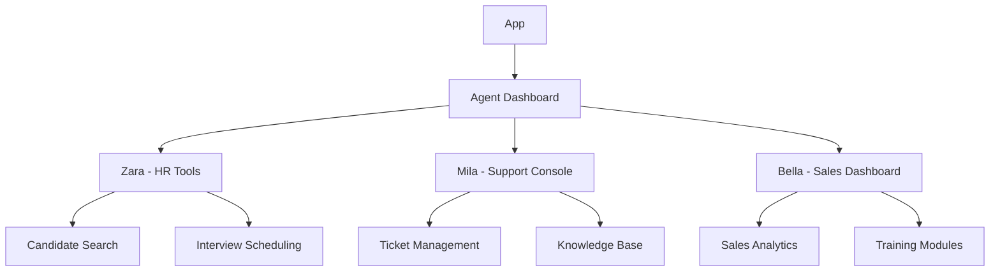

# Lumid AI - AI Agents Management Platform

## 🚀 Introduction

Lumid AI is a cutting-edge platform featuring three specialized AI agents designed to automate and optimize business processes. Built with React, TypeScript, and Vite for maximum performance.

## ✨ Key Features

### 🤖 AI Agents
| Agent | Role | Description |
|-------|-----|--------|
| **Zara** | Hiring Recruiter | Finds and attracts top talent for your company |
| **Mila** | Customer Support | Handles all customer inquiries and resolves issues |
| **Bella** | Sales Mentor | Develops sales strategies and provides team training |

### 💻 Technical Capabilities
- ⚡ Lightning-fast performance with Vite
- 🛠 Robust codebase with TypeScript
- 🔥 Modern UI with React 18
- 📱 Fully responsive design
- 🌐 Real-time communication

## 🛠 Installation

### Prerequisites
```bash
node -v # v18.0.0 or higher
npm -v  # v9.0.0 or higher
```

### Clone and Setup
```bash
git clone https://github.com/lumid-ai/core.git
cd core
npm install
```

### Configuration
```env
# .env example
VITE_API_KEY=your_api_key_here
VITE_HR_API_URL=https://api.lumid.ai/hr  # For Zara
VITE_SUPPORT_API_URL=https://api.lumid.ai/support  # For Mila
VITE_SALES_API_URL=https://api.lumid.ai/sales  # For Bella
```

## 🏗 Project Structure

```
lumid-ai/
├── public/               # Static files
├── src/
│   ├── api/              # API requests
│   ├── assets/           # Images, fonts
│   ├── components/       # UI components
│   ├── features/         # Feature modules
│   │   ├── hiring/       # Zara (HR)
│   │   ├── support/      # Mila (Support)
│   │   └── sales/        # Bella (Sales)
│   ├── stores/           # State management
│   ├── styles/           # Global styles
│   ├── types/            # TypeScript interfaces
│   └── main.tsx          # Application entry point
├── .eslintrc.js          # ESLint config
├── vite.config.ts        # Vite config
└── tsconfig.json         # TypeScript config
```

## 🧩 Component Architecture



## 🎯 Core Agent Functionalities

### Zara (HR Agent)
- ✅ Automated candidate screening
- ✅ CV analysis
- ✅ Interview scheduling
- ✅ Candidate database management

### Mila (Support Agent)
- ✅ Customer request processing
- ✅ Automated responses system
- ✅ Knowledge Base management
- ✅ Live chat with customers

### Bella (Sales Agent)
- ✅ Sales analytics and reporting
- ✅ Sales strategy development
- ✅ Sales team training
- ✅ Client contract management

## 📊 Integrations

- **For Zara**: LinkedIn API, Greenhouse, Workable
- **For Mila**: Zendesk, Freshdesk, Intercom
- **For Bella**: Salesforce, HubSpot, Pipedrive

## 🚀 Production Deployment

```bash
npm run build
```

### Docker Setup
```dockerfile
FROM node:18 as builder
WORKDIR /app
COPY . .
RUN npm install && npm run build

FROM nginx:alpine
COPY --from=builder /app/dist /usr/share/nginx/html
EXPOSE 80
CMD ["nginx", "-g", "daemon off;"]
```

## 📞 Support

Dedicated support for each agent:
- **Zara**: hr-support@lumid.ai
- **Mila**: customer-support@lumid.ai
- **Bella**: sales-support@lumid.ai
